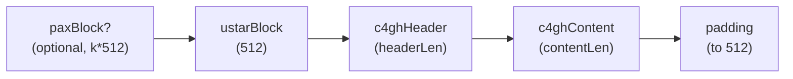
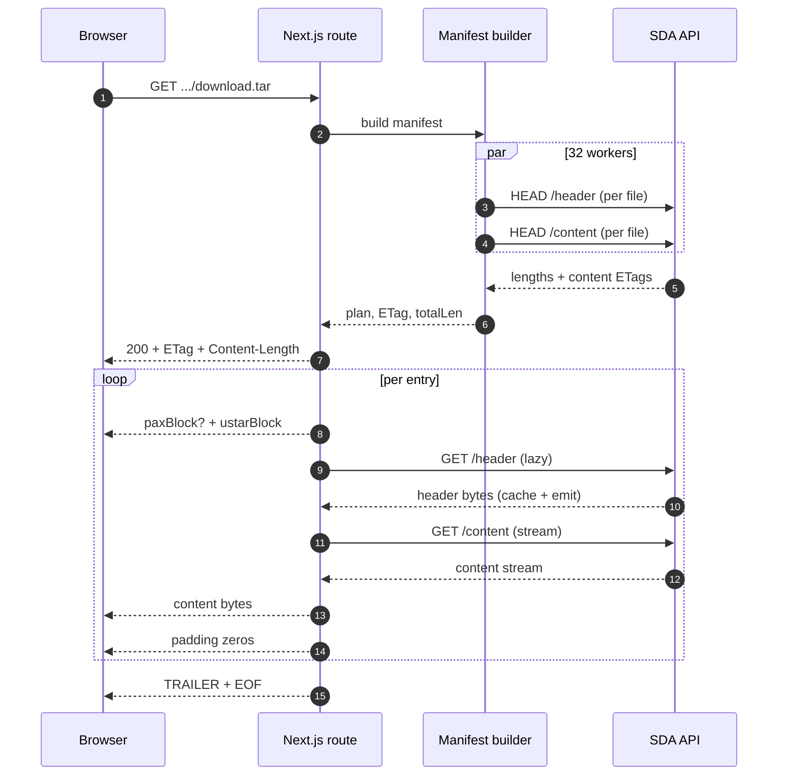
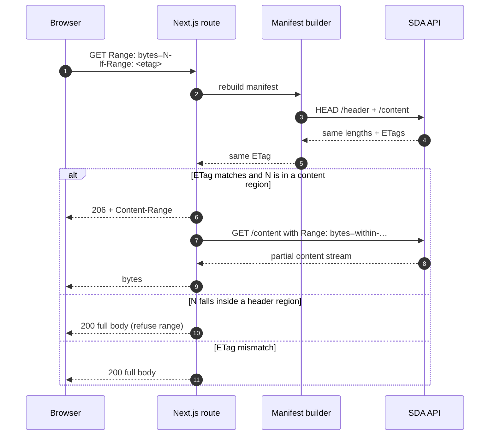
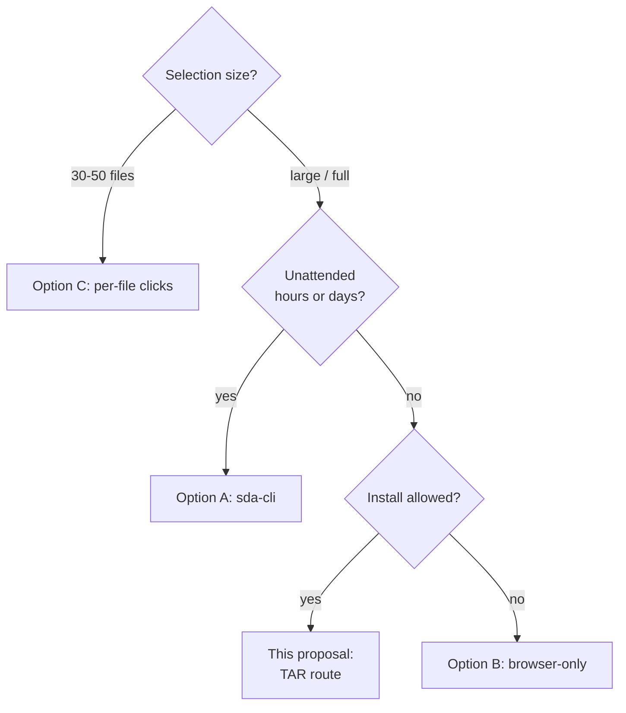

# SDA Download UI — Bulk Download Architecture

**Status:** Proposed implementation.
**Companion to:** *Bulk Dataset Download — Decision Meeting Document*.

---

## 1. Context

### 1.1 What we have today

A Next.js proxy in front of the SDA Data Out API that handles session-cookie auth, attaches the Crypt4GH public key to upstream calls, stitches header + content, and supports `Range`/`If-Range` on a stable per-file ETag.

```mermaid
flowchart LR
    B[Browser] -- cookie --> P[Next.js proxy<br/>/api/files/&#123;id&#125;]
    P -- bearer + public key --> S[SDA Data Out API]
    S -- header + content --> P
    P -- bytes --> B
```



### 1.2 What we are adding

A **bulk download** path: one click delivers a whole dataset (or a selected subset) as a single resumable file, with folder structure preserved, no new install, reusing the existing session and key model.

### 1.3 Where this sits

This is a **server-side variant of Option B** in the decision document — zero-install, one-click, no Service Worker. Not a replacement for Option A (`sda-cli`) for multi-day unattended transfers.

---

## 2. Goals and non-goals

**Goals:** one-click bulk download, folder structure preserved, resumable, no new install, reuses existing auth + key, no new persistent server state.

**Non-goals:** unattended multi-day transfers, compression, plaintext re-encryption, intra-stream parallelism.

---

## 3. Working assumptions

1. **Header length stability.** `Content-Length` of `GET /files/{id}/header` is constant per `(fileId, key)`. Header *bytes* may vary.
2. **Header reuse within an emit.** Once a header is fetched in a request, we splice content onto those bytes; we never resume mid-header.
3. **Content stability.** `/content` is byte-stable with `Range` + stable ETag (spec).
4. **Session lifetime** covers the whole transfer.
5. **One concurrent bulk download per user.**
6. **Dataset immutability** for a given `datasetId` (spec).

---

## 4. The proposed architecture

New route:

```
GET  /api/datasets/{datasetId}/download.tar[?fileIds=<csv>]
HEAD /api/datasets/{datasetId}/download.tar[?fileIds=<csv>]
```

Streams a **deterministic, store-only POSIX TAR (PAX/USTAR)** containing the dataset's `.c4gh` files at their original `filePath`s.

### 4.1 Component view

```mermaid
flowchart TB
    subgraph Browser
        DD["DatasetDetails: Download dataset"]
        DF["DatasetFiles: Download selected as TAR"]
        DM[Browser download manager<br/>pause / resume / save]
        DD --> DM
        DF --> DM
    end

    subgraph "Next.js (Node runtime)"
        R["/api/datasets/&#123;id&#125;/download.tar"]
        MB["Manifest builder (HEAD only)"]
        RP[Region planner]
        TS[TAR streamer<br/>Node Readable]
        R --> MB --> RP --> TS
    end

    subgraph "SDA Data Out API"
        HH["HEAD /files/&#123;id&#125;/header"]
        HC["HEAD /files/&#123;id&#125;/content"]
        GH["GET /files/&#123;id&#125;/header"]
        GC["GET /files/&#123;id&#125;/content"]
    end

    DM -- cookie + Range/If-Range --> R
    TS -- bytes --> DM
    MB -- bearer + key --> HH
    MB -- bearer --> HC
    TS -- bearer + key, lazy --> GH
    TS -- bearer + Range --> GC
```



### 4.2 Why TAR

Store-only TAR has no trailing index, so byte offsets are a pure function of the manifest — making `Range` resume safe and deterministic. ZIP's central directory at the end makes mid-stream resume effectively impossible.

### 4.3 The resume invariant

For any byte offset `N`:

- **Static regions** (PAX/USTAR blocks, padding, trailer): deterministic from the manifest.
- **Content bytes**: upstream-stable per Assumption 3.
- **Header bytes**: length-stable per Assumption 1; pinned within a request per Assumption 2.

The ETag (§5.4) binds the inputs; any change flips it and forces a clean 200.

### 4.4 Archive layout



```
archive := entry[0] | entry[1] | … | entry[N-1] | TRAILER(1024 zero bytes)
```

Entries sorted by `filePath` (byte-lexicographic). No directory entries. Fixed `mode=0644`, `uid=gid=0`, `mtime=dataset.date`.

### 4.5 Response headers

| Header                | Value                                       |
| --------------------- | ------------------------------------------- |
| `Content-Type`        | `application/x-tar`                         |
| `Content-Disposition` | `attachment; filename="<datasetId>.tar"…`   |
| `Content-Length`      | precomputed total                           |
| `Accept-Ranges`       | `bytes`                                     |
| `ETag`                | sha256 over manifest + key + layout version |
| `Cache-Control`       | `no-store`                                  |

### 4.6 Resume protocol

Standard HTTP — browser download managers and `curl -C -` already speak it. Ranges that land mid-header are refused and we fall through to a full 200.

---

## 5. Data flow

### 5.1 Happy path



### 5.2 Resume path



### 5.3 Manifest build

Concurrent (default 32) `HEAD /header` + `HEAD /content` per file. From the results we precompute `plan[i]`, prefix sums `entryStart[i]`, `totalLen`, and the ETag.

### 5.4 ETag

```
sha256(
  "sda-tar-v1\n" + pemChecksum + "\n" +
  for each entry: fileId \t contentEtag \t filePath \n
)
```

Header *bytes* are deliberately excluded — only their length matters (Assumption 1). The ETag is stable across process restarts.

### 5.5 Streamer state

```mermaid
stateDiagram-v2
    [*] --> Idle
    Idle --> DrainContent: active reader & bytes left
    Idle --> CheckEnd: no reader
    CheckEnd --> EOF: pos >= end
    CheckEnd --> EmitStatic: region is static
    CheckEnd --> OpenContent: region is content
    EmitStatic --> Idle: push chunk, advance
    OpenContent --> DrainContent: reader opened
    DrainContent --> Idle: push chunk; if region drained, advance
    EOF --> [*]
```



### 5.6 Lazy header fetching

Headers fetched on first emit, verified against the `HEAD` length, cached per entry for the lifetime of the request.

### 5.7 Memory and concurrency

- ~2 KB per file for tar planning; ~124 B per touched header; ~1.2 MB total for a 10k-file pass.
- Pre-stream: 32 concurrent HEADs.
- Stream-time: one content read at a time.

---

## 6. Trade-offs and known limits

- **Pre-stream latency** is paid on every resume; HEAD-only build keeps it to single-digit seconds even for huge datasets. Manifest caching is a future option.
- **Tab lifecycle:** pause/resume in the download manager works; closing the browser entirely is browser-specific. Power users use `curl -C -`.
- **Selection cap:** 1000 fileIds per URL; whole-dataset URL has no cap.
- **No intra-stream parallelism:** single serial stream by design.
- **Resume identity:** changes to file set, ordering, content ETag, or `pemChecksum` invalidate resume (clean 200). Header byte drift does not.
- **Header length stability** is the only load-bearing backend assumption; violation is detected and surfaced as 502.

---

## 7. Comparison with the other options



| Aspect                     | This proposal (TAR)             | Option A (sda-cli)       | Option B (browser)            | Option C (per-file clicks) |
| -------------------------- | ------------------------------- | ------------------------ | ----------------------------- | -------------------------- |
| Best for                   | Full dataset / large selection  | Full dataset, unattended | Full dataset, no install      | 30–50 files                |
| Install required           | None                            | `sda-cli`                | None                          | None                       |
| Output                     | One `.tar`                      | Native folder tree       | Folder (Chromium) / `.zip`    | Files in Downloads         |
| Folder structure preserved | Yes (inside TAR)                | Yes                      | Yes                           | No                         |
| Whole-archive resume       | Yes                             | n/a                      | No                            | n/a                        |
| Tab lifecycle              | Pause/resume OK; close brittle  | Browser can close        | Tab must stay open            | Tab must stay open         |
| Multi-day unattended       | No                              | Yes                      | No                            | No                         |
| New backend deps           | None                            | None                     | None                          | Service Worker             |

The TAR route's sweet spot: a few hundred to a few thousand files, one resumable download, zero install.

---

## 8. UI integration

```mermaid
flowchart LR
    subgraph DatasetDetails
        BD["Download dataset"]
    end
    subgraph DatasetFiles
        BS["Download selected as TAR"]
    end
    BD --> URL1["/api/datasets/&#123;id&#125;/download.tar"]
    BS --> URL2["/api/datasets/&#123;id&#125;/download.tar?fileIds=…"]
```

Both entry points are plain `<a download>` anchors — no client-side download machinery.



Both buttons disabled with explanatory `title` when no public key is configured. Selection button disabled when 0 or >1000 selected.

Docs/tooltips should mention browser pause/resume, `curl -C -` for power users, and the `sda-cli` path for huge unattended transfers.

---

## 9. Backend prerequisites

| Requirement                                       | Status                  |
| ------------------------------------------------- | ----------------------- |
| Per-file `/header` and `/content`                 | already used            |
| `Range` + `ETag` on `/content`                    | spec                    |
| Stable `Content-Length` on `/header` per (id,key) | assumed; spec-conformant|
| `HEAD /header` with the recipient key             | required                |
| New persistent state                              | none                    |
| New auth surface                                  | none                    |
| Service Worker                                    | not used                |

---

## 10. Recommendation

**Short term:** TAR route as the default "Download dataset" / "Download selected" action. Option C remains the right tool for small-batch native-file UX. Option A documented and linked for unattended multi-day workflows.

**Long term:** consider caching manifests by `(datasetId, pemChecksum, fileIdSetHash)`; revisit Option B if browser capabilities improve; keep the per-file proxy as the foundation.

---

## 11. Open questions

1. Pre-stream UX for multi-second manifest builds — spinner or explicit progress?
2. Right concurrency cap (32 today)? Per-user limiting?
3. Cache manifests server-side, or accept the per-resume cost?
4. Dedicated docs page for power-user resume workflows?
